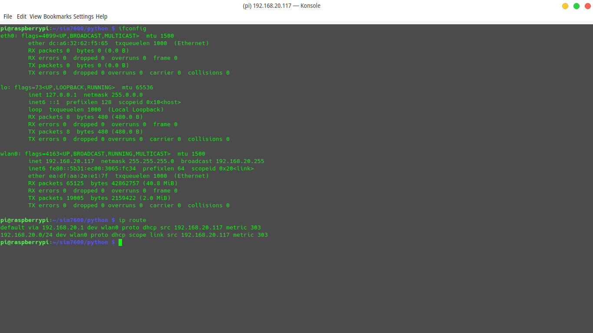
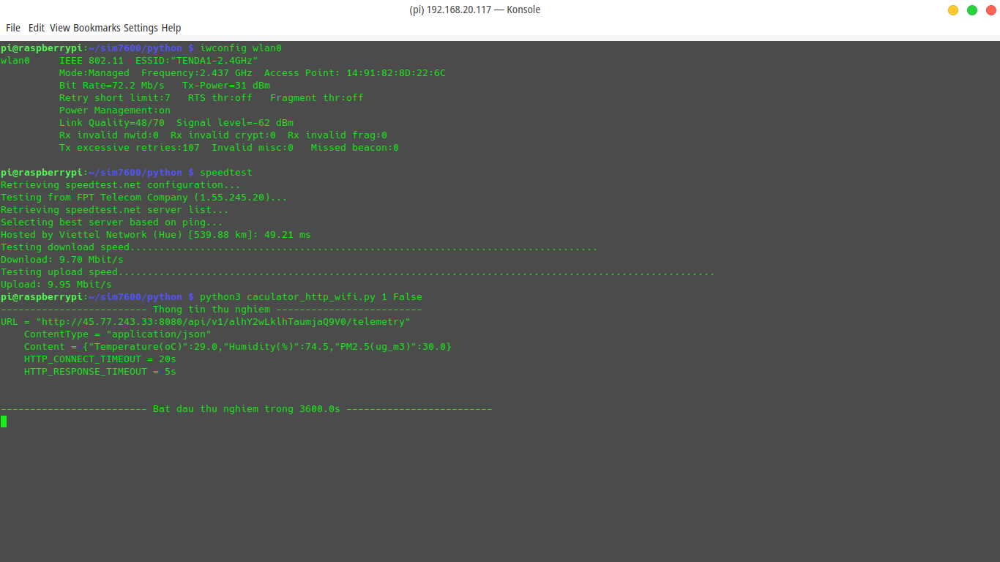
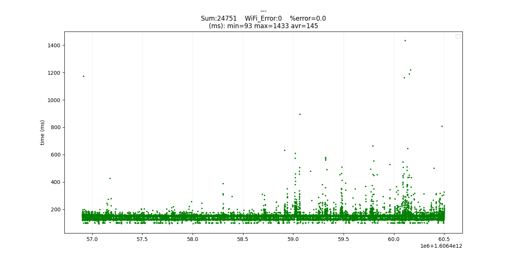
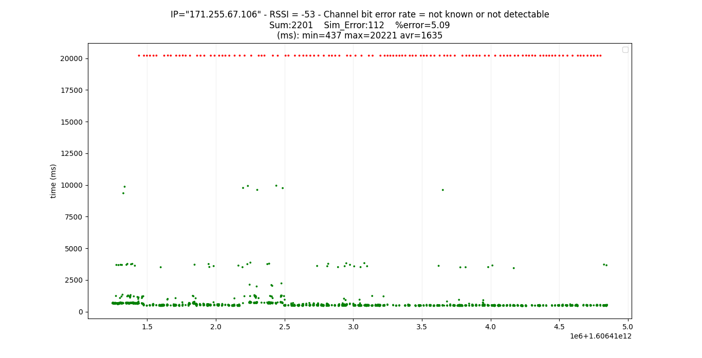

# So sánh thời gian gửi HTTP thông qua WiFi và SIM7600 4G

## Phần cứng
- [Raspberry Pi 4 bản 2G RAM](https://www.raspberrypi.org/documentation/hardware/raspberrypi/bcm2711/rpi_DATA_2711_1p0_preliminary.pdf)
- [SIM7600CE](https://www.waveshare.com/wiki/SIM7600CE_4G_HAT)

## Hạ tầng mạng:
- WiFi: `TENDA1-2.4GHz` tại phòng `C1-311`.
- 4G: sim `4G Viettel`.

## Kịch bản thử nghiệm

### Server:
- Thingboard.
- URL=`http://45.77.243.33:8080/api/v1/alhY2wLklhTaumjaQ9V0/telemetry`
- Dữ liệu gửi tới Server:
    + Protocol: `HTTP`
    + Method: `POST`
    + Content Type: `application/json`
    + Data: `{"Temperature(C)":29.0,"Humidity(%)":74.5,"PM2.5(ug_m3)":30.0}`

### Lập trình:
- Ngôn ngữ: Python (version 3).
- Giao tiếp `SIM7600CE` qua `AT Commands, Baudrate = 115200`.
- Thời gian kết nối tối đa `HTTP_CONNECT_TIMEOUT = 20s`.
- Thời gian tối đa nhận phản hồi `HTTP_RESPONSE_TIMEOUT = 5s`.

### Nội dung thử nghiệm:
- **Đo thời gian gửi dữ liệu lên Server bằng liên tục hoặc chỉ bằng WiFi hoặc chỉ bằng SIM7600 trong 1h.**
- Thống kê số tổng số bản tin gửi đi và tổng số bản tin lỗi (không gửi được).

## Kết quả

**Thông số mạng khi bắt đầu thử nghiệm:**

**WiFi:**

**SIM7600:**

- RSSI: -53dBm.
- IP: 171.255.67.106

**Kết quả được vẽ trong hình dưới.**

    Lưu ý:
    - Chấm xanh: gửi thành công.
    - Chấm đỏ: gửi lỗi.
    - Trục x vẽ theo thời gian đơn vị ms. Thời gian tính theo UTC, tính từ 0h0m0s 1/1/1970.

### WiFi

### SIM7600

## Kết luận
